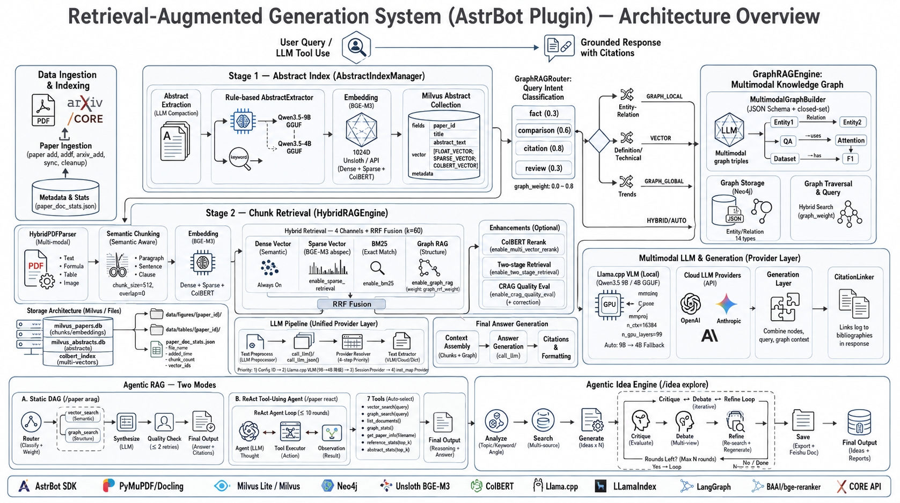

# 📚 Paper RAG Plugin v2.0.4 — 用户指南

本地论文库 RAG 检索插件，为 AstrBot 提供智能论文检索、知识图谱增强问答和研究想法生成。支持多模态（图片/表格/公式）提取、Llama.cpp VLM 本地问答和 Agentic RAG（LangGraph 工作流）。

> **版本说明**：当前版本 v2.0.4，完整更新历史见 [CHANGELOG.md](docs/CHANGELOG.md)，按版本拆分索引见 [docs/changelog/INDEX.md](docs/changelog/INDEX.md)

### 本版变化 (v2.0.4)

- **Bug 修复**：修复 `paper_link_resolver.py` 中 `@staticmethod` 错误使用 `self` 导致的 `NameError`。
- **测试套件清理**：删除 1 个过期测试文件、1 个过期测试函数、3 个引用已移除参数的测试；修复 3 个测试文件的 mock Context 兼容性；跳过 5 个环境依赖测试。
- **安全加固**：移除 4 个测试文件中的硬编码 Neo4j 密码，统一通过 `test/_test_utils.py::get_neo4j_password()` 读取插件配置。
- **Code Review**：删除空测试类 `TestGraphRAGConfigConstruction`，重写 `test_crag_json_parse.py` 使用正确导入。
- 完整变更详见 [docs/changelog/2.0.4.md](docs/changelog/2.0.4.md)

---

## 🏗️ 系统架构



PaperRAG 是一个多层学术论文问答系统，支持从简单向量检索到 Agentic 自主推理的多种查询模式：

**检索流水线**：
- **单阶段 3 通道混合检索**：稠密向量（BGE-M3） + 稀疏权重（ABSPEC） + BM25 精确匹配，通过 RRF 融合
- **两阶段检索**（可选）：Stage 1 摘要匹配 → ColBERT 重排序 → 知识图谱独立召回 → Stage 2 chunk 检索
- **可选增强**：ColBERT 多向量重排序、CRAG 质量评估

**知识图谱增强**：`MultimodalGraphBuilder` 从论文 Chunk 中自动抽取知识三元组，使用 Neo4j 作为图存储后端，JSON Schema 精确约束 LLM 输出。支持 **9 类实体**（Method、Model、Task、Dataset、Metric、Component、Limitation、Application、Baseline）和 **14 类关系**（ADDRESSES、PROPOSES、USES_COMPONENT、EVALUATED_ON、ACHIEVES、COMPARES_WITH、LIMITED_BY、APPLIES_TO、EXTENDS、TRAINS_ON、IMPLEMENTS、OUTPERFORMS、REQUIRES、ABLATES_ON）。两阶段检索中，图谱作为独立召回通道（Stage 1.6）补充论文召回，不与向量/BM25 走同一 RRF 融合，避免文本打分过滤掉结构相关但摘要匹配度低的论文。

**Agentic 工作流**（LangGraph，可选启用）：
- **静态 DAG** (`/paper arag`)：router → [vector_search ∥ graph_search] 并行 → synthesize → quality_check 反馈循环
- **ReAct Tool-Using Agent** (`/paper react`)：LLM 自主推理 → 工具选择 → 结果观察 → 迭代，7 个自主工具

**Idea 生成**（可选启用）：analyze → search → generate → critique → debate → refine → save，支持自反思迭代优化和飞书文档导出。

**多模态支持**：Docling/PyMuPDF 提取 PDF 中的图片、表格、公式，`LlamaCppVLMProvider`（Qwen3.5 GGUF，9B/4B 自动降级）支持本地图片问答。

详细架构见 [docs/ARCHITECTURE.md](docs/ARCHITECTURE.md)，Agentic 工作流详解见 [docs/AGENTIC_ARCHITECTURE.md](docs/AGENTIC_ARCHITECTURE.md)。

---

## ✨ 核心功能

- 🔍 **混合检索**：稠密向量 + 稀疏权重（ABSPEC）+ BM25 精确匹配 三通道 RRF 融合，知识图谱独立召回（两阶段）
- 🧠 **Agentic RAG**：LangGraph 静态 DAG + ReAct Tool-Using Agent（7 个自主工具），智能查询分类与多跳推理
- 🕸️ **知识图谱**：Neo4j 图数据库，9 类实体 + 14 类关系，LLM 自动三元组抽取，多模态图谱构建
- 💡 **Idea 生成**：线性 + Agentic 迭代优化（自反思 critique→debate→refine 循环），飞书文档导出
- 🖼️ **多模态处理**：PDF 图片/表格/公式提取，Llama.cpp VLM 本地图片问答（9B/4B 自动降级）
- 📄 **多格式支持**：PDF、Word、TXT、Markdown、HTML
- 💾 **完全本地**：Unsloth BGE-M3 本地 Embedding + Llama.cpp 本地 VLM + Milvus Lite 本地向量库
- ⚡ **缓存加速**：查询结果缓存
- 🏎️ **重排序**：ColBERT 多向量 MaxSim Late Interaction

---

## 🚀 快速开始

### 1. 安装依赖

```bash
cd ~/AstrBot/data/plugins/astrbot_plugin_paperrag
pip install -r requirements.txt
```

### 2. 配置插件

在 **AstrBot WebUI → 插件 → paper_rag → 插件配置** 中：

| 配置项 | 推荐值 | 说明 |
|-------|--------|------|
| Embedding模式 | `unsloth` | 免费无限制，BGE-M3 本地加载 |
| 向量嵌入维度 | `1024` | BGE-M3 固定 1024 维 |
| 文本问答 Provider | （选取） | 用于 RAG 答案生成 |
| 论文文件存放目录 | `./papers` | PDF 存放路径 |

> ⚠️ 首次使用时 BGE-M3 模型会自动下载到 `./models/bge-m3/`。也可手动下载：
> ```bash
> huggingface-cli download unsloth/bge-m3 --local-dir ./models/bge-m3
> ```

### 3. 使用

```bash
# 添加论文
/paper add ./papers

# 搜索问答
/paper search transformer 的核心创新点是什么？

# Agentic 复杂查询（需在配置中开启 enable_agentic_rag）
/paper arag 3D Gaussian Splatting 和 NeRF 的优劣对比
/paper react 本地论文库中关于扩散模型的最新进展
```

---

## 📖 命令速查

### /paper — 检索与问答

| 命令 | 权限 | 说明 |
|------|------|------|
| `/paper search <query>` | 公开 | RAG 搜索并生成回答 |
| `/paper search <query> retrieve` | 公开 | 仅检索，不生成回答 |
| `/paper arag <query>` | 公开 | Agentic RAG 复杂查询（静态 DAG） |
| `/paper react <query>` | 公开 | ReAct Tool-Using Agent 自主查询 |
| `/paper list` | 公开 | 列出所有已索引文档 |
| `/paper refstats [top_k]` | 公开 | 参考文献引用频次统计 |
| `/paper refstats -1` | 公开 | 列出无参考文献的论文 |
| `/paper abstractstats [top_k]` | 公开 | 摘要提取统计 |
| `/paper abstractstats -1` | 公开 | 列出未提取摘要的论文 |

### /paper — 论文管理（管理员）

| 命令 | 说明 |
|------|------|
| `/paper add [目录]` | 批量添加论文 |
| `/paper addf <文件>` | 添加单个论文 |
| `/paper delete <文件名>` | 删除指定论文 |
| `/paper clear confirm` | 清空知识库 |
| `/paper rebuild [目录] confirm` | 清空并重建 |
| `/paper rebuildf <文件> confirm` | 重建单个论文 |
| `/paper reparse_zero_ref confirm` | 批量重解析零引用论文 |
| `/paper reparse_zero_abstract confirm` | 批量重提取缺失摘要 |

### /paper arxiv — arXiv 集成

| 命令 | 权限 | 说明 |
|------|------|------|
| `/paper arxiv_list` | 公开 | 列出带 arXiv URL 的论文 |
| `/paper arxiv_add <关键词> [数量]` | 管理员 | 搜索、下载并添加 |
| `/paper arxiv_refs [top_k] [数量]` | 管理员 | 下载高引参考文献 |
| `/paper arxiv_sync confirm` | 管理员 | 同步 MCP 下载的论文 |
| `/paper arxiv_cleanup confirm` | 管理员 | 清理旧版本 arXiv 论文 |

### /paper graph — 知识图谱管理

| 命令 | 权限 | 说明 |
|------|------|------|
| `/paper graph_build` | 公开 | 构建知识图谱 |
| `/paper graph_stats` | 公开 | 图谱统计信息 |
| `/paper graph_link <实体>` | 公开 | 查询实体关系 |
| `/paper graph_rebuild confirm` | 管理员 | 重建图谱 |
| `/paper graph_clear confirm` | 管理员 | 清空图谱 |
| `/paper graph_backup [online\|offline]` | 管理员 | 备份图谱 |
| `/paper graph_restore <文件>` | 管理员 | 恢复图谱 |
| `/paper graph_backup_list` | 公开 | 列出可用备份 |

### /idea — 研究想法生成

| 命令 | 权限 | 说明 |
|------|------|------|
| `/idea gen <主题>` | 公开 | 生成研究想法（线性） |
| `/idea explore <主题>` | 公开 | 探索研究想法（Agentic 迭代优化） |
| `/idea analyze <主题>` | 公开 | 分析研究主题 |
| `/idea search <主题>` | 公开 | 多源知识检索 |
| `/idea generate <主题>` | 公开 | 从知识上下文生成想法 |
| `/idea list` | 公开 | 列出已保存主题 |
| `/idea show <主题>` | 公开 | 查看主题下想法 |
| `/idea add <主题>` | 公开 | 追加想法 |
| `/idea del <UUID>` | 公开 | 删除指定想法 |
| `/idea delete <主题>` | 公开 | 删除主题 + 文件夹 |
| `/idea clear <主题>` | 公开 | 清空主题（保留文件夹） |
| `/idea tofeishu <主题> [folder_token]` | 公开 | 导出飞书文档 |
| `/idea regen <UUID>` | 公开 | 重新生成指定想法 |

---

## ⚙️ 配置详解

插件通过 AstrBot WebUI 管理约 60 个配置项，完整 schema 见 `_conf_schema.json`。以下为核心配置分类：

### LLM Provider

| 配置项 | 说明 | 默认值 |
|-------|------|--------|
| `text_provider_id` | 文本问答 LLM | 空（使用当前会话 Provider） |
| `multimodal_provider_id` | 多模态问答 LLM | 空（使用本地 VLM） |
| `text_llm_temperature` | 文本 LLM 温度 | `0.7` |
| `text_llm_max_tokens` | 文本 LLM 最大 token 数 | `2048` |

### Llama.cpp 本地 VLM

| 配置项 | 说明 | 默认值 |
|-------|------|--------|
| `llama_vlm_model_path` | GGUF 模型路径 | `./models/Qwen3.5-9B-GGUF/...` |
| `llama_vlm_mmproj_path` | mmproj 路径 | `./models/Qwen3.5-9B-GGUF/mmproj-BF16.gguf` |
| `llama_vlm_n_ctx` | 上下文窗口 | `16384` |
| `llama_vlm_n_gpu_layers` | GPU 层数 | `99` |
| `llama_vlm_max_tokens` | 最大生成 token | `2560` |
| `llama_vlm_temperature` | 生成温度 | `0.7` |

> 自动降级：优先 9B 模型，不可用时自动切换到 4B。

### Embedding / Unsloth BGE-M3

| 配置项 | 说明 | 默认值 |
|-------|------|--------|
| `embedding_mode` | 模式：`unsloth` 或 `api` | `unsloth` |
| `embed_dim` | 向量维度（BGE-M3=1024） | `768` |
| `unsloth.model_path` | BGE-M3 模型路径 | `./models/bge-m3` |
| `unsloth.device` | 运行设备：`mps`/`cuda`/`cpu` | `mps` |

### 检索配置

| 配置项 | 说明 | 默认值 |
|-------|------|--------|
| `top_k` | 返回片段数 | `5` |
| `similarity_cutoff` | 相似度阈值 | `0.5` |
| `enable_sparse_retrieval` | 稀疏权重检索 (ABSPEC) | `true` |
| `enable_bm25` | BM25 精确匹配 | `true` |
| `enable_multi_vector_rerank` | ColBERT 重排序 | `false` |

### Agentic / Graph RAG

| 配置项 | 说明 | 默认值 |
|-------|------|--------|
| `enable_agentic_rag` | 启用 Agentic RAG | `false` |
| `enable_agentic_ideas` | 启用 Agentic Idea Engine | `false` |
| `enable_graph_rag` | 启用 Graph RAG | `false` |


### 分块配置

| 配置项 | 说明 | 默认值 |
|-------|------|--------|
| `chunk_size` | 分块字符数 | `512` |
| `chunk_overlap` | 块间重叠 | `0` |
| `min_chunk_size` | 最小块大小 | `128` |
| `use_semantic_chunking` | 语义分块 | `true` |

---

## 💡 使用技巧

- **选择合适的分块大小**：学术论文推荐 `512-768`，长篇报告推荐 `768-1024`
- **提高搜索准确度**：使用具体问题、包含专业术语、调整 `top_k` 和 `similarity_cutoff`
- **加速导入**：使用 Unsloth 模式（无 API 限制）、禁用图片提取（`multimodal.extract_images: false`）
- **Agentic 模式**：复杂对比、多跳推理、引用溯源类问题开启 `enable_agentic_rag`，使用 `/paper arag` 或 `/paper react`

---

## ❓ 常见问题

### RAG 引擎未就绪

检查 WebUI → 设置 → 模型提供商中是否已添加 Embedding Provider，确认插件配置中 Provider ID 正确。

### 导入后 chunks=0

确认 PDF 不是扫描版；确保 docling/PyMuPDF 依赖已安装：`pip install -r requirements.txt`

### 搜索结果不准确

尝试增大 `chunk_size`、降低 `similarity_cutoff`、增加 `top_k`，或开启稀疏检索和 BM25。

### ColBERT 重排序不可用

确保 `embedding_mode=unsloth`、BGE-M3 模型存在于 `models/bge-m3/`。MPS 内存不足时可改 `unsloth.device` 为 `cpu` 或关闭 `enable_multi_vector_rerank`。

### Llama.cpp VLM 不可用

检查 GGUF 模型和 mmproj 文件路径。插件支持 9B→4B 自动降级。安装命令：
```bash
CMAKE_ARGS="-DGGML_METAL=on -DLLAMA_MTMD=on" pip install llama-cpp-python
```

---

## 📚 详细文档

| 文档 | 说明 |
|------|------|
| [docs/ARCHITECTURE.md](docs/ARCHITECTURE.md) | 架构设计、组件说明、文件结构 |
| [docs/AGENTIC_ARCHITECTURE.md](docs/AGENTIC_ARCHITECTURE.md) | Agentic RAG + Agentic Ideas 工作流详解 |
| [docs/CHANGELOG.md](docs/CHANGELOG.md) | 变更记录 |
| [docs/changelog/INDEX.md](docs/changelog/INDEX.md) | 按版本拆分的变更索引 |
| [docs/cypher_queries.md](docs/cypher_queries.md) | Neo4j Cypher 查询参考 |
| [docs/INDEX.md](docs/INDEX.md) | 文档索引 |

---

## 📞 获取帮助

- **问题反馈**：通过 [GitHub Issues](https://github.com/HUSTcyf/astrbot_plugin_paperrag/issues) 提交
- **日志查看**：AstrBot 控制台输出

---

## 📄 许可证

MIT License

## 🙏 致谢

- [AstrBot](https://github.com/AstrBotDevs/AstrBot) — 聊天机器人框架
- [Milvus](https://milvus.io/) — 向量数据库
- [PyMuPDF](https://pymupdf.readthedocs.io/) — PDF 解析
- [Docling](https://github.com/DS4SD/docling) — 多模态文档解析
- [Neo4j](https://neo4j.com/) — 图数据库
- [PaperBanana](https://github.com/dwzhu-pku/PaperBanana) — AI 学术图表生成
- [Unsloth](https://unsloth.ai/) — BGE-M3 本地加速
