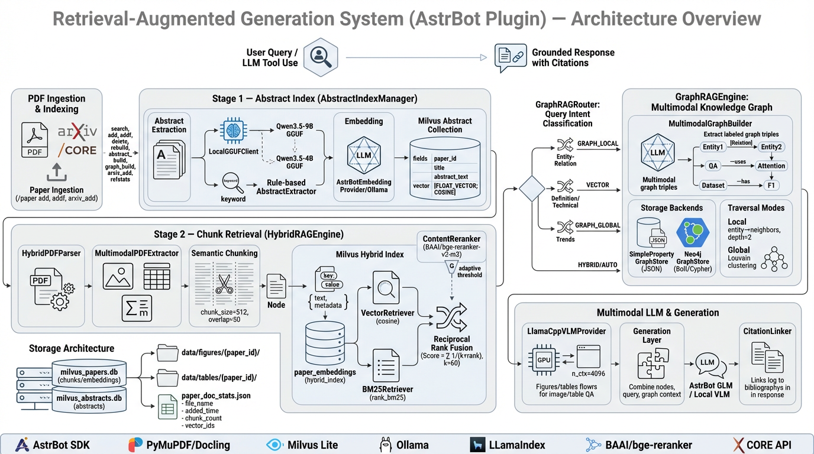

# 📚 Paper RAG Plugin v1.12.1 - 用户指南

本地论文库RAG检索插件，为AstrBot提供智能的论文检索和问答能力（支持多模态VLM问答）。

> **版本说明**：当前版本 v1.12.1，完整更新历史见 [CHANGELOG.md](docs/CHANGELOG.md)

## 🏗️ 系统架构



PaperRAG 是一个基于两阶段检索的学术论文问答系统，其架构如下：

**两阶段检索流程：**

1. **Stage 1 - 摘要索引**：`AbstractIndexManager` 通过 `LocalGGUFClient`（Qwen3.5-9B GGUF 模型）提取论文摘要，或回退到基于关键词的规则提取。摘要向量存储在独立的 Milvus collection (`paper_abstracts`)，查询时先通过摘要匹配快速过滤出相关论文。

2. **Stage 2 - Chunk 检索**：`HybridRAGEngine` 在 Stage 1 筛选出的论文集内执行混合检索：
   - **向量检索**：基于 cosine 相似度（BGE-M3 稠密向量 1024维）
   - **稀疏权重检索**：BGE-M3 稀疏权重通过 ABSPEC 公式计算关键词相似度
   - **RRF 融合**：双路分数通过 Reciprocal Rank Fusion 融合 (k=60)
   - **可选重排序**：通过 ColBERT 多向量 MaxSim Late Interaction 重排

**知识图谱增强**：`GraphRAGEngine` 通过 `MultimodalGraphBuilder` 从 Chunk 中提取知识三元组（实体-关系-实体），支持 MemoryGraphStore（JSON 持久化）和 Neo4j 两种存储后端，支持局部遍历和全局遍历。

**多模态支持**：`HybridPDFParser` 通过 Docling/PyMuPDF 提取 PDF 中的图片、表格、公式，`LlamaCppVLMProvider`（Qwen3.5 GGUF）支持图片问答。

**生成层**：检索到的 Chunk 与查询结合，通过 AstrBot GLM Provider 或本地 VLM 生成带引用的答案。

详细架构设计见 [paperrag_architecture_prompt.txt](docs/paperrag_architecture_prompt.txt)。

---

## ✨ 核心功能

- 🔍 **混合检索**：稀疏权重(ABSPEC) + BGE-M3 稠密向量 + BM25 精确匹配三路召回 + RRF 分数融合，兼顾精确术语匹配与语义理解
- 💡 **AI问答**：结合检索内容生成准确、有引用的答案
- 📄 **多格式支持**：PDF、Word、TXT、Markdown、HTML
- 🖼️ **多模态提取**：自动识别PDF中的图片、表格、公式
- 🖼️ **多模态查询**：支持图片输入进行VLM问答（原图+VLM）
- 💾 **本地存储**：所有数据存储在本地，保护隐私
- ⚡ **缓存加速**：常用查询结果缓存，响应更快
- 🦙 **Unsloth本地Embedding**：使用 Unsloth BGE-M3 本地加载，支持稠密向量+稀疏权重+多向量输出
- 🏎️ **重排序支持**：ColBERT 多向量 MaxSim Late Interaction 加速检索精度

---

## 🚀 快速开始（5分钟）

### 第一步：安装插件

```bash
cd ~/AstrBot/data/plugins/astrbot_plugin_paperrag
pip install -r requirements.txt
```

### 第二步：配置插件

**方式A：使用Unsloth本地Embedding（推荐，免费无限制）**

在 **AstrBot WebUI → 插件 → paper_rag → 插件配置** 中：

| 配置项 | 值 | 说明 |
|-------|-----|------|
| Embedding模式 | `Unsloth本地模式` | 使用Unsloth BGE-M3 |
| 向量嵌入维度 | `1024` | BGE-M3固定1024维 |
| 文本问答Provider | （从AstrBot选取） | 用于RAG回答生成 |
| 论文文件存放目录 | `./papers` | PDF存放路径 |
| 启用插件 | ✅ | - |

> ⚠️ **Unsloth BGE-M3 模型会自动下载**：
> 首次使用时会自动从 HuggingFace 下载 `unsloth/bge-m3` 模型到 `./models/bge-m3/`
> 可选手动下载：
> ```bash
> # 手动下载 BGE-M3 模型
> huggingface-cli download unsloth/bge-m3 --local-dir ./models/bge-m3
> ```
> 详细配置见：[OLLAMA_GUIDE.md](docs/OLLAMA_GUIDE.md)（BGE-M3 部分）

**方式B：使用Gemini API（快速，有配额限制）**

| 配置项 | 值 | 说明 |
|-------|-----|------|
| Embedding模式 | `API模式` | 使用API |
| Embedding 服务提供商 | `gemini_embedding` | Gemini Embedding API |
| 向量嵌入维度 | `768` | Gemini固定768维 |
| 文本问答Provider | （从AstrBot选取） | 用于RAG回答生成 |
| 论文文件存放目录 | `./papers` | PDF存放路径 |
| 启用插件 | ✅ | - |

### 第三步：使用插件

```bash
# 1. 创建论文目录并放入PDF文件
mkdir papers
cp ~/Downloads/*.pdf papers/

# 2. 添加文档到知识库
/paper add

# 3. 搜索论文
/paper search 这篇论文的主要创新点是什么？
```

---

## 📖 使用说明

### 命令速查

| 命令 | 功能 | 示例 |
|------|------|------|
| `/paper search <问题>` | 搜索并生成回答 | `/paper search attention机制的原理` |
| `/paper search <问题> retrieve` | 仅检索相关片段 | `/paper search CNN retrieve` |
| `/paper list` | 查看已收录文档 | `/paper list` |
| `/paper add [目录]` | 添加文档（需管理员） | `/paper add ~/Documents/papers` |
| `/paper addf <文件路径>` | 添加单个文件（需管理员） | `/paper addf ./papers/attention.pdf` |
| `/paper delete <文件名>` | 删除指定论文（需管理员） | `/paper delete attention.pdf` |
| `/paper rebuild [目录] confirm` | 清空并重建知识库 | `/paper rebuild ./papers confirm` |
| `/paper clear confirm` | 清空知识库（需管理员） | `/paper clear confirm` |
| `/paper refstats [top_k] [dedup=0]` | 查看参考文献引用统计（需管理员） | `/paper refstats 20 dedup=1` |
| `/paper refstats -1` | 列出无参考文献的论文 | `/paper refstats -1` |
| `/paper reparse_zero_ref confirm` | 批量重新解析无参考文献的论文（需管理员） | `/paper reparse_zero_ref confirm` |
| `/paper arxiv_add <关键词> [数量]` | 从arXiv搜索下载论文并添加（需管理员） | `/paper arxiv_add attention is all you need 3` |
| `/paper arxiv_refs [top_k] [每篇数量]` | 下载高频引用论文（需管理员） | `/paper arxiv_refs 10 3` |
| `/paper arxiv_sync confirm` | 同步MCP已下载论文到数据库（需管理员） | `/paper arxiv_sync confirm` |
| `/paper arxiv_cleanup confirm` | 清理arXiv论文旧版本（需管理员） | `/paper arxiv_cleanup confirm` |
| `/paper abstract_build confirm [N]` | 构建摘要索引（支持跳过前N篇，检查点恢复） | `/paper abstract_build confirm 30` |
| `/paper graph_build` | 构建知识图谱（需管理员） | `/paper graph_build` |
| `/paper graph_stats` | 查看图谱统计信息 | `/paper graph_stats` |
| `/paper graph_rebuild confirm` | 重建知识图谱（清空+重建） | `/paper graph_rebuild confirm` |
| `/paper graph_clear confirm` | 清空知识图谱（需管理员） | `/paper graph_clear confirm` |
| `/paper graph_backup [online\|offline]` | 备份图谱（需管理员） | `/paper graph_backup online` |
| `/paper graph_backup_list` | 列出可用备份 | `/paper graph_backup_list` |
| `/paper graph_restore [文件名]` | 恢复图谱备份（需管理员） | `/paper graph_restore neo4j_backup_xxx.json.gz` |
| `/paper graph_link [status\|create\|remove]` | 管理Neo4j符号链接 | `/paper graph_link status` |
| `/idea tofeishu <研究主题> [folder_token]` | 将研究想法导出为飞书文档 | `/idea tofeishu 大语言模型研究` |

### 使用示例

**示例1：添加论文**

```
你: /paper add
Bot: 🔍 扫描目录: ./papers
Bot: 📄 发现 10 个文档文件
Bot: ⏳ 开始导入...
Bot: ✅ [1/10] deep_learning.pdf - 85 个片段
Bot: ✅ [2/10] transformer.pdf - 92 个片段
...
Bot: ✅ 导入完成
Bot: 📊 总计: 10 个文件, 850 个片段
Bot: 💡 提示: 使用 /paper search [问题] 来检索文档
```

**示例2：搜索问答**

```
你: /paper search 什么是注意力机制？
Bot: 🔍 正在检索文档库...
Bot:
Bot: 💡 **回答**
Bot:
Bot: 注意力机制（Attention Mechanism）是一种神经网络架构...
Bot:
Bot: 📚 **参考文献**
Bot:
Bot: [1] **attention_is_all_you_need.pdf** (片段 #12)
Bot: > The attention mechanism allows the model to focus on...
```

---

## 🔬 arXiv 集成功能

插件提供多种方式获取论文并添加到数据库。

### arXiv MCP 同步

已配置的 arXiv MCP 服务器（`/Volumes/ext/arxiv`）下载的论文可以同步到 paperrag 数据库：

```
/paper arxiv_sync        # 查看待处理数量
/paper arxiv_sync confirm # 执行同步
```

### arXiv 论文清理

清理 arXiv 下载目录中的旧版本论文，只保留最新版本：

```
/paper arxiv_cleanup        # 查看待清理数量
/paper arxiv_cleanup confirm # 执行清理
```

**说明**：
- 自动识别同一论文的多个版本（如 `2603.11298.pdf` 和 `2603.11298v2.pdf`）
- 删除旧版本，保留最高版本号
- 同时清理 macOS 元数据文件（`._*`）

### 从 arXiv 搜索下载

使用 arXiv MCP 搜索论文并下载：

```
/paper arxiv_add <搜索关键词> [最大数量]
```

**示例**：
```
你: /paper arxiv_add attention is all you need 3
Bot: 🔍 在arXiv搜索: "attention is all you need"
Bot: 📡 正在搜索arXiv...
Bot: ✅ 找到 3 篇论文
Bot: 📄 [1/3] Attention Is All You Need
Bot:    📥 下载PDF: https://arxiv.org/pdf/1706.03762.pdf
Bot:    ✅ 下载完成 (8.2 MB)
Bot:    ✅ 已添加到数据库 (chunks: 45)
...
```

### 自动下载高频引用论文

根据已有文献的参考文献统计，自动下载被引用最多的论文：

```
/paper arxiv_refs [top_k] [每篇最大下载数]
```

**示例**：
```
你: /paper arxiv_refs 10 3
Bot: 📊 正在获取高频引用论文统计...
Bot: 📚 找到 156 种参考文献，取前 10 个高频引用
Bot: [1/10] 📝 Attention Is All You Need
Bot:    🔍 搜索: Attention Is All You Need Vaswani 2017
Bot:    📥 下载: 1706.03762v5.pdf
Bot:    ✅ 已添加到数据库
...
```

**工作流程**：
1. 调用 `/paper refstats` 获取高频引用论文列表
2. 对每个高频引用，使用标题+作者+年份构建搜索查询
3. 从 arXiv 下载相关论文
4. 自动添加到数据库
5. 跳过已存在的 PDF 文件

### 参考文献统计

查看数据库中论文的引用频次统计：

```
/paper refstats [top_k] [dedup=0]
```

**参数说明**：
- `top_k`: 返回前 N 条高频频引用（默认 20）
- `dedup`: 去重模式
  - `0`（默认）: 原始统计，每篇论文对同一参考文献的多次引用分别计数
  - `1`: 去重模式，每篇论文对同一参考文献只计 1 次

**示例**：
```
/paper refstats 20        # 原始统计
/paper refstats 20 dedup=1  # 去重统计
```

**示例输出**：
```
📚 **参考文献统计**

📊 统计概览:
   • 涉及论文种类: 156
   • 引用总条次: 892（去重后: 234）
   • 处理文档块: 234

🔝 **Top 20 高频引用论文**（去重）

 1. [ 15次] **Attention Is All You Need**
    └─ Vaswani, A. et al. (2017)
 2. [ 12次] **BERT: Pre-training of Deep Bidirectional**
    └─ Devlin, J. et al. (2018)
 3. [  8次] **Language Models are Few-Shot Learners**
    └─ Brown, T. et al. (2020)
...
```

---

## 📚 LLM 参考文献解析

插件支持使用 LLM（GPT-4o-mini）自动解析参考文献的标题、作者、年份等信息。

### 工作原理

1. **整段文本解析**：将参考文献部分（可能跨多行）作为整体发送给 LLM
2. **自动识别边界**：LLM 根据学术引用格式自动识别每条参考文献的边界
3. **结构化提取**：解析出标题、作者、年份、期刊、DOI 等字段
4. **双向关联建立**：将正文中的引用与参考文献关联

### 配置

LLM 参考文献解析使用 `evaluation/freeapi.json` 中的 API 配置：

```json
{
    "API_URL": "https://free.v36.cm",
    "API_KEY": "sk-..."
}
```

如需修改 API，请编辑 `evaluation/freeapi.json` 文件。

### 特性

| 特性 | 说明 |
|------|------|
| **自动边界识别** | 无需正则表达式启发式规则，LLM 自动识别跨行引用 |
| **并发控制** | 最多 4 个并发请求，避免 API 限流 |
| **自动重试** | HTTP 429/500 错误自动重试 |
| **表格过滤** | 自动检测并跳过表格，避免误解析 |
| **后备方案** | LLM 解析失败时自动降级到正则表达式解析 |

### 配置项

| 配置项 | 说明 | 默认值 |
|-------|------|--------|
| `enable_llm_reference_parsing` | 启用 LLM 参考文献解析 | `true` |

### API 配置说明

API 配置从 `evaluation/freeapi.json` 读取，包含：
- `API_URL`: API 基础地址
- `API_KEY`: API 密钥

> 💡 如需使用其他 API 服务，修改 `evaluation/freeapi.json` 中的配置即可。

### MCP 参考文献补全（可选）

默认禁用 MCP（arXiv）参考文献 enrichment。如需启用，在 `reference_processor.py` 中取消注释：

```python
# MCP 参考文献补全（如需启用，取消注释以下代码）
# if self.arxiv_client and valid_results:
#     await self._enrich_from_arxiv(valid_results)
```

---

## ⚙️ 配置详解

### 基础配置

| 配置项 | 说明 | 默认值 | 推荐值 |
|-------|------|--------|--------|
| `enabled` | 启用插件 | `true` | ✅ |
| `embedding_mode` | Embedding模式 | `unsloth` | `unsloth`（推荐）/ `api` |
| `embedding_provider_id` | Embedding Provider ID（API模式） | `gemini_embedding` | Gemini / OpenAI |
| `compress_provider_id` | 上下文压缩LLM | 空 | 从AstrBot提供商选取 |
| `text_provider_id` | 文本问答LLM | 空 | 从AstrBot提供商选取 |
| `multimodal_provider_id` | 多模态问答LLM | 空 | 从AstrBot提供商选取（用于图片问答） |
| `papers_dir` | 论文目录 | `./papers` | `./papers` |
| `figures_dir` | 图片存储目录 | `data/figures` | 插件目录下的 data/figures |
| `embed_dim` | 向量维度 | `768` | `1024` (BGE-M3) / `768` (Gemini) / `1536` (OpenAI) |

> 💡 **Embedding模式对比**：
> - **Unsloth模式**：免费、无限制、隐私保护、本地加载 BGE-M3（推荐）
> - **API模式**：快速、有配额限制、需要API密钥

### Unsloth本地Embedding配置

| 配置项 | 说明 | 默认值 | 推荐值 |
|-------|------|--------|--------|
| `unsloth.model_path` | BGE-M3模型路径 | `./models/bge-m3` | 默认 |
| `unsloth.device` | 运行设备 | `mps` | `mps`（Apple Silicon）/ `cuda`（NVIDIA）/ `cpu` |
| `unsloth.max_seq_length` | 最大序列长度 | `512` | 默认 |

> 🦙 **Unsloth BGE-M3 配置指南**：[OLLAMA_GUIDE.md](docs/OLLAMA_GUIDE.md)（BGE-M3 部分）

### 检索配置

| 配置项 | 说明 | 默认值 | 推荐值 |
|-------|------|--------|--------|
| `top_k` | 返回片段数 | `5` | `5` |
| `similarity_cutoff` | 相似度阈值 | `0.3` | `0.3` |
| `enable_sparse_retrieval` | 启用稀疏权重检索(ABSPEC) | `true` | ✅ |
| `sparse_top_k` | 稀疏检索召回数量 | `20` | `20-50` |
| `hybrid_alpha` | RRF 融合权重 | `0.5` | `0.5`（平等权重） |
| `enable_noise_filter` | 启用噪声过滤(LLM) | `true` | ✅ |

> 💡 **Embedding Provider 说明**：插件使用 Unsloth BGE-M3 本地加载，支持稠密向量、稀疏权重、多向量三种输出。

### 分块配置

| 配置项 | 说明 | 默认值 | 推荐值 |
|-------|------|--------|--------|
| `chunk_size` | 分块大小（字符） | `512` | `512` (论文) / `384` (文档) |
| `chunk_overlap` | 块间重叠 | `0` | `0` |
| `min_chunk_size` | 最小块大小 | `100` | `100` |
| `use_semantic_chunking` | 智能分块 | `true` | ✅ |

### 多模态配置

| 配置项 | 说明 | 默认值 |
|-------|------|--------|
| `enable_multimodal` | 启用多模态 | `true` |
| `multimodal.extract_images` | 提取图片 | `true` |
| `multimodal.extract_tables` | 提取表格 | `true` |
| `multimodal.extract_formulas` | 提取公式 | `true` |
| `multimodal.nms_iou_threshold` | 图片去重阈值 | `0.5` |
| `multimodal.enable_nms` | 启用NMS去重 | `true` |

> 💡 **VLM路由说明**：满足以下任一条件时，自动使用 `multimodal_provider_id` 配置的多模态模型进行回答：
> - 查询含视觉关键词（"图"、"表格"、"公式"、"架构"等）
> - 查询询问数量/比较/性能指标（"How many...", "Which is better...", "accuracy"等）
> - 检索文本内容提到 Figure/Table/Algorithm 等
> - 检索结果关联图片或图表 captions

**生产环境推荐配置**：
```json
{
    "enable_multimodal": true,
    "multimodal": {
        "extract_images": false,
        "extract_tables": true,
        "extract_formulas": true
    }
}
```

### Llama.cpp 本地 VLM 配置（当 multimodal_provider_id 为空时使用）

当未配置 `multimodal_provider_id` 时，插件会自动使用本地 Llama.cpp VLM 进行图片问答。

**自动降级**：插件会优先使用 9B 模型，9B 模型不存在或加载失败时自动降级到 4B 模型。

| 配置项 | 说明 | 默认值 | 推荐值 |
|-------|------|--------|--------|
| `llama_vlm_model_path` | GGUF 模型路径 | `./models/Qwen3.5-9B-GGUF/Qwen3.5-9B-UD-Q4_K_XL.gguf` | 9B/4B 均可 |
| `llama_vlm_mmproj_path` | mmproj 视觉编码器路径 | `./models/Qwen3.5-9B-GGUF/mmproj-BF16.gguf` | 与模型配套 |
| `llama_vlm_n_ctx` | 上下文窗口大小 | `4096` | `4096` |
| `llama_vlm_n_gpu_layers` | GPU 加速层数 | `99` | `99`（全部 GPU） |
| `llama_vlm_max_tokens` | 最大生成 token 数 | `2560` | `512-4096` |
| `llama_vlm_temperature` | 生成温度 | `0.7` | `0.7` |

> 💡 **Llama.cpp VLM 优势**：
> - 模型常驻内存，首次加载后推理快速（~1秒）
> - 支持多图输入
> - Apple Metal GPU 加速
> - 完全本地运行，无需 API
> - **自动降级**：9B 不可用时自动使用 4B

**安装步骤**：

1. 安装 llama-cpp-python（含多模态支持）：
```bash
# macOS Apple Silicon
CMAKE_ARGS="-DGGML_METAL=on -DLLAMA_MTMD=on" pip install llama-cpp-python

# NVIDIA GPU
# CMAKE_ARGS="-DGGML_CUDA=on -DLLAMA_MTMD=on" pip install llama-cpp-python
```

2. 模型下载（插件首次初始化时会自动下载，也可手动执行）：
```bash
# 9B 模型（约 5.6GB Q4 量化）
mkdir -p models
hf download unsloth/Qwen3.5-9B-GGUF Qwen3.5-9B-UD-Q4_K_XL.gguf --local-dir ./models/Qwen3.5-9B-GGUF
hf download unsloth/Qwen3.5-9B-GGUF mmproj-BF16.gguf --local-dir ./models/Qwen3.5-9B-GGUF

# 4B 模型（约 2.7GB Q4 量化，备用）
hf download unsloth/Qwen3.5-4B-GGUF Qwen3.5-4B-UD-Q4_K_XL.gguf --local-dir ./models/Qwen3.5-4B-GGUF
hf download unsloth/Qwen3.5-4B-GGUF mmproj-BF16.gguf --local-dir ./models/Qwen3.5-4B-GGUF
```

3. 配置路径（基于插件目录）：
```
llama_vlm_model_path = ./models/Qwen3.5-9B-GGUF/Qwen3.5-9B-UD-Q4_K_XL.gguf
llama_vlm_mmproj_path = ./models/Qwen3.5-9B-GGUF/mmproj-BF16.gguf
```

4. 验证安装：
```bash
python -c "
from llama_cpp import Llama
llama = Llama('./models/Qwen3.5-9B-GGUF/Qwen3.5-9B-UD-Q4_K_XL.gguf', mmproj='./models/Qwen3.5-9B-GGUF/mmproj-BF16.gguf')
print('✅ Llama.cpp VLM 安装成功')
"
```

### PaperBanana 方法图生成配置

PaperBanana 是一个**本地部署的 AI 学术图表生成服务**，可以将方法论文本自动转化为精美的论文方法流程图。

**应用场景**：研究想法生成后，自动将技术方案转化为 Pipeline 架构图，插入飞书文档周报。

| 配置项 | 说明 | 默认值 |
|-------|------|--------|
| `enable_paper_banana` | 启用 PaperBanana 方法图生成 | `false` |

> 💡 **功能说明**：
> - 启用后，`/idea tofeishu` 导出飞书文档时，自动根据方法论章节内容生成方法流程图
> - 图片插入到方法论章节末尾
> - Caption 优先从 `data/captions/` 目录读取，若无则由本地 VLM 生成

**安装 PaperBanana**：

1. **克隆部署**：
```bash
git clone https://github.com/dwzhu-pku/PaperBanana.git
cd PaperBanana
```

2. **安装依赖**：
```bash
pip install -r requirements.txt
```

3. **配置 API Key**：
```bash
# 启动时填入你的 apiyi key（支持 Gemini/GPT 等）
python app.py
# 访问 http://127.0.0.1:7860 配置 key
```

4. **安装 gradio_client**：
```bash
pip install gradio>=6.0.0
```

5. **验证安装**：
```bash
# 确认服务运行中（http://127.0.0.1:7860）
python -c "
from gradio_client import Client
c = Client('http://127.0.0.1:7860')
print('✅ PaperBanana 连接成功')
"
```

**生成效果示例**：

用户输入方法论文本（如"特征提取 → 跨模态对齐 → 开放词汇分割 → 3DGS 渲染"），PaperBanana 生成如下风格的方法图：

- 清晰的 Pipeline 流程（输入 → 处理模块 → 输出）
- 学术论文风格（适合直接插入投稿论文或周报）
- 支持多种比例（16:9、4:3 等）

**技术实现**：

| 方法 | 说明 |
|------|------|
| `_call_paperbanana()` | 调用本地 Gradio 服务生成方法图 |
| `_refactor_for_paperbanana()` | 用本地 VLM 将方法论文本转述为图表描述格式 |
| `_generate_method_figures_with_paperbanana_from_text()` | 从完整方法论文本生成图表 |
| `test_paperbanana_image()` | 测试 PaperBanana 图片插入飞书文档 |

---

### 重排序配置

| 配置项 | 说明 | 默认值 | 推荐值 |
|-------|------|--------|--------|
| `enable_multi_vector_rerank` | 启用 ColBERT 多向量重排序 | `false` | ✅（提升精度） |
| `reranking_adaptive` | 自适应模式 | `true` | ✅ |
| `reranking_threshold` | 分数阈值 | `0.0` | `0.0` |

> 💡 **ColBERT 多向量重排序说明**：
> - **原理**：ColBERT (Late Interaction) 每个 query token 和 doc token 分别编码为向量，检索时用 MaxSim 计算相似度
> - **优势**：兼顾语义理解与精确词项匹配，比 Cross-Encoder 更快且支持长 doc
> - **性能提升**：检索精度提升15-25%
> - **延迟增加**：200-500ms（MPS加速）
> - **依赖**：BGE-M3 多向量输出（Unsloth 模式自动启用）

**配置场景示例**：

1. **新手/默认配置**（推荐）
```json
{
  "enable_multi_vector_rerank": true
}
```

2. **Apple Silicon Mac**（MPS加速）
```json
{
  "enable_multi_vector_rerank": true,
  "reranking_batch_size": 64
}
```

3. **NVIDIA GPU**（CUDA加速）
```json
{
  "enable_multi_vector_rerank": true,
  "reranking_batch_size": 128
}
```

4. **低内存/CPU**
```json
{
  "enable_multi_vector_rerank": true,
  "reranking_batch_size": 16
}
```

5. **高精度模式**
```json
{
  "enable_multi_vector_rerank": true,
  "reranking_threshold": 0.3
}
```

### 混合检索配置（稠密向量 + 稀疏权重 + BM25）

混合检索通过 **三路召回 + RRF 分数融合** 兼顾关键词精确匹配与语义理解：

| 配置项 | 说明 | 默认值 | 推荐值 |
|-------|------|--------|--------|
| `enable_sparse_retrieval` | 是否启用稀疏权重检索(ABSPEC) | `true` | ✅ |
| `sparse_top_k` | 稀疏检索召回数量 | `20` | `20-50` |
| `hybrid_alpha` | RRF 向量权重（0=纯稀疏，1=纯向量） | `0.5` | `0.5` |
| `hybrid_rrf_k` | RRF 常数 k | `60` | 默认 |
| `enable_bm25` | 是否启用 BM25 精确匹配 | `true` | ✅ |
| `bm25_top_k` | BM25 召回数量 | `20` | `20-50` |

> **精确匹配检测**：当查询包含专有名词（作者名、论文标题）、数字（年份、DOI、arXiv ID）、事实性问题（who/when/where/which name）时，自动启用 BM25 精确匹配。

**检索流程**：
```
Query
  ├─ 稠密向量搜索(Milvus) ──→ COSINE ──→ top_k 候选
  ├─ 稀疏权重搜索(ABSPEC) ──→ token hidden states ──→ top_k 候选
  └─ BM25 精确匹配（按需）──→ jieba分词 ──→ top_k 候选
                        ↓
              RRF 分数融合（2路或3路）─→ 排序取 top_k
```

**典型配置**：

1. **默认（推荐）** — 关键词与语义兼顾
```json
{
  "enable_sparse_retrieval": true,
  "sparse_top_k": 20,
  "hybrid_alpha": 0.5,
  "enable_bm25": true,
  "bm25_top_k": 20
}
```

2. **强关键词匹配** — 适合专有名词、技术术语查询
```json
{
  "enable_sparse_retrieval": true,
  "sparse_top_k": 50,
  "hybrid_alpha": 0.3,
  "enable_bm25": true,
  "bm25_top_k": 50
}
```

3. **强语义理解** — 适合复杂问题、同义表述查询
```json
{
  "enable_sparse_retrieval": true,
  "sparse_top_k": 20,
  "hybrid_alpha": 0.7,
  "enable_bm25": true,
  "bm25_top_k": 20
}
```

> ⚠️ **注意**：`bm25_top_k` 应大于最终 `top_k`，确保 RRF 融合时有足够候选；`enable_bm25` 与 `enable_reranking` 可同时开启，混合检索结果再经重排序二次优化。

---

## 💡 使用技巧

### 1. 选择合适的分块大小

| 文档类型 | 推荐chunk_size | 说明 |
|---------|---------------|------|
| 学术论文 | `512-768` | 保留更多上下文 |
| 技术文档 | `384-512` | 平衡精度和速度 |
| 长篇报告 | `768-1024` | 减少分块数量 |

### 2. 提高搜索准确度

- **使用具体问题**：避免太宽泛的问题
- **包含关键词**：提问时使用专业术语
- **调整top_k**：增加返回片段数（默认5）
- **调整相似度阈值**：提高 `similarity_cutoff` 过滤低质量结果
- **使用图片查询**：支持图片输入进行多模态检索

### 3. 加速导入

- **使用Unsloth**：本地 BGE-M3 批量向量化，无API限制（推荐）
- **批量Embedding**：自动启用批量处理
- **批量导入**：一次性添加多个PDF
- **禁用图片提取**：设置 `multimodal.extract_images: false`
- **使用SSD**：将Milvus数据库放在SSD上

---

## ❓ 常见问题

### Q1: 提示"RAG引擎未就绪"

**原因**：Embedding Provider未配置或配置错误

**解决**：
1. 检查 WebUI → 设置 → 模型提供商
2. 确认已添加 Embedding Provider
3. 检查插件配置中的 Provider ID 是否正确

### Q2: 导入后chunks=0

**原因**：PDF是扫描版（无文本层）或依赖未安装

**解决**：
1. 确认PDF不是扫描版
2. 安装依赖：`pip install -r requirements.txt`
3. 运行测试：`python test/test_semantic_chunker.py paper.pdf`

### Q3: 搜索结果不准确

**原因**：分块大小不合适或相似度阈值过高

**解决**：
1. 调整 `chunk_size`（尝试增大）
2. 降低 `similarity_cutoff`（如0.2）
3. 增加 `top_k`（返回更多结果）

### Q4: 提示"RPD配额耗尽"

**原因**：Gemini API每日1000次请求限制

**解决**：
1. 已优化批量调用，通常足够使用
2. 在 [AI Studio](https://aistudio.google.com/) 绑定账单，配额提升至150,000+
3. 切换其他Embedding Provider（如OpenAI）

### Q5: transformers导入错误

**原因**：未安装图片向量化依赖（正常）

**解决**：无需处理，系统会自动降级到文本模式，不影响使用

### Q6: ColBERT 多向量重排序不可用

**原因**：BGE-M3 多向量未正确加载

**解决**：
```bash
# 确保安装了 unsloth
pip install unsloth
# 确保 BGE-M3 模型存在
ls models/bge-m3/
```

**检查配置**：
- 确认 `embedding_mode` 设置为 `unsloth`
- 确认 `enable_multi_vector_rerank` 设置为 `true`

**MPS加速不可用**：
- 检查macOS版本 ≥ 12.3
- 更新PyTorch: `pip install --upgrade torch`

### Q7: 批量请求超过100个文本错误

**症状**: `at most 100 requests can be in one batch`

**原因**: Gemini API单次批量请求限制为100个文本

**解决**: ✅ 插件已自动处理，会自动分批无需手动干预

**技术细节**:
- 插件自动检测文本数量
- 超过100个时自动分批处理（每批100个）
- 完全透明，不影响使用体验

---

## 📚 详细文档

| 文档 | 说明 |
|------|------|
| [README.md](README.md) | 用户指南（本文档） |
| [CHANGELOG.md](CHANGELOG.md) | 变更记录 |
| [docs/INDEX.md](docs/INDEX.md) | 文档索引 |
| [docs/ARCHITECTURE.md](docs/ARCHITECTURE.md) | 技术架构说明 |

---

## 📈 Qasper 数据集评估

插件支持使用 Qasper 数据集评估 RAG 系统的性能。

### 免费 API 配置

RAGAS 评估流程需要使用 **GPT-4o-mini** 生成测试问题和评估答案。

**免费 API 获取方法**：
- 项目地址：[free_chatgpt_api](https://github.com/popjane/free_chatgpt_api)
- 提供免费的 GPT-4o-mini API

**配置步骤**：

1. **在 WebUI 中配置**（推荐）：
   - 插件配置 → `FreeAPI 服务地址`：填入如 `https://free.v36.cm`
   - 插件配置 → `FreeAPI 密钥`：填入从 free_chatgpt_api 获取的 API Key

2. **或手动编辑配置文件**：
   ```
   /Users/chenyifeng/AstrBot/data/config/astrbot_plugin_paperrag_config.json
   ```
   添加以下字段：
   ```json
   {
     "freeapi_url": "https://free.v36.cm",
     "freeapi_key": "你的API密钥"
   }
   ```

### Qasper 数据集说明

**Qasper 数据集不包含 PDF 文件**，只包含从论文提取的文本内容（full_text）。

### 评估流程

```
1. 下载数据集 (qasper_downloader.py)
       ↓
2. 索引论文到 Milvus (index_qasper.py)
       ↓
3. 生成 predictions (run_evaluation_qasper.py --generate)
       ↓
4. 运行评估 (run_evaluation_qasper.py --evaluate 或 --all)
```

### 快速开始

```bash
# 1. 下载数据集
cd datasets
python qasper_downloader.py

# 2. 索引论文到 Milvus
cd evaluation
python index_qasper.py --reinit

# 3. 生成 Predictions（支持断点续传）
python run_evaluation_qasper.py --generate

# 4. 运行评估
python run_evaluation_qasper.py --evaluate

# 或一步完成
python run_evaluation_qasper.py --all
```

### 命令行参数

**index_qasper.py**：
| 参数 | 说明 | 默认值 |
|------|------|--------|
| `--split` | 数据集划分 | `all` |
| `--reinit` | 重新初始化数据库 | False |

**run_evaluation_qasper.py**：
| 参数 | 说明 |
|------|------|
| `--generate` | 仅生成 predictions（支持断点续传） |
| `--evaluate` | 仅运行评估 |
| `--all` | 生成 + 评估 |
| `--no_resume` | 禁用断点续传，重新生成所有预测 |
| `--llm_only` | 纯LLM基线模式：不进行检索，直接使用LLM回答（用于基线对比） |
| `--bert_score` | 使用BERTScore F1进行语义评估（更适合QASPER长文档自由形式答案） |
| `--limit N` | 限制处理的问题数量（默认0不限制，用于快速测试） |

### RAGAS 评测（基于本地 Milvus 数据库）

RAGAS 评测直接从本地 Milvus 数据库加载已索引的论文，自动生成测试问答对并评估 RAG 系统性能。

**注意**：Qasper 数据集评估和 RAGAS 评测是两种不同的评估方式：
- **Qasper 数据集**：使用标准学术数据集，对比不同 RAG 系统性能
- **RAGAS 评测**：基于本地已索引论文，评估当前系统的实际表现

### RAGAS 快速开始

```bash
# 完整流程（提取文本 -> 生成测试集 -> 评估 -> 报告）
python -m evaluation.run_evaluation_ragas --step all --test-size 100

# 仅生成测试集（需要已有 chunks 文件）
python -m evaluation.run_evaluation_ragas --step generate --test-size 100 --max-rpm 96

# 使用已有 chunks 文件（避免重复从 Milvus 读取）
python -m evaluation.run_evaluation_ragas --step all --use-existing-chunks --test-size 100
```

### RAGAS 命令行参数

| 参数 | 说明 | 默认值 |
|------|------|--------|
| `--step` | 执行步骤：`all`/`extract`/`generate`/`evaluate` | `all` |
| `--test-size` | 生成测试问题数量 | 50 |
| `--max-rpm` | RPM 限制（避免 API 限流） | 96 |
| `--max-concurrent` | 最大并发数 | 5 |
| `--embedding-mode` | Embedding 模式：`api`/`unsloth` | `unsloth` |
| `--output-dir` | 输出目录 | `results` |
| `--use-existing-chunks` | 使用已有 chunks 文件 | False |
| `--existing-chunks-path` | 已有 chunks 文件路径 | `results/milvus_chunks.json` |

**环境变量**：
- `EVAL_LLM_API_KEY`：评估用 LLM API Key

**注意**：`freeapi_key` 和 `freeapi_url` 需在插件配置中设置（`/Users/chenyifeng/AstrBot/data/config/astrbot_plugin_paperrag_config.json`）
| 参数 | 说明 |
|------|------|
| `--generate` | 仅生成 predictions（支持断点续传） |
| `--evaluate` | 仅运行评估 |
| `--all` | 生成 + 评估 |
| `--no_resume` | 禁用断点续传，重新生成所有预测 |
| `--llm_only` | 纯LLM基线模式：不进行检索，直接使用LLM回答（用于基线对比） |
| `--bert_score` | 使用BERTScore F1进行语义评估（更适合QASPER长文档自由形式答案） |
| `--limit N` | 限制处理的问题数量（默认0不限制，用于快速测试） |

### 评估指标

- **Answer F1**: 答案 F1 分数（基于词汇重叠）
- **Answer BERT F1**: 答案 BERTScore F1（基于语义相似度，更适合QASPER长文档）
- **Answer F1 by type**: 按答案类型 (extractive/abstractive/boolean/none) 的 F1
- **Evidence F1**: 证据 F1 分数
- **Missing predictions**: 缺失预测数量

> 💡 **为什么需要 BERTScore F1？**
> QASPER 数据集平均上下文长度超过 23,000 字符，自由形式答案导致相同语义可用不同表达。
> 研究表明：Cosine F1 = 0.22（过于严格），BERTScore F1 = 0.62（更合理）。
> 布尔问题（No/False, Yes/True）语义等价但词汇不同，BERTScore 更公平。

### 输出文件

```
evaluation_output/
├── predictions.jsonl       # 预测结果
└── evaluation_results.json # 评估指标
```

### 详细文档

详见 [evaluation/README_qasper.md](evaluation/README_qasper.md)

---

## 📋 待实现功能 (ToDo)

以下功能正在规划中，将在未来的版本中逐步实现。

### ✅ Graph RAG 模块

将现有向量检索升级为**图增强 RAG**，支持多跳推理和关系查询。

**已实现功能**：
- [x] Graph RAG 引擎（`graph_rag_engine.py`）
- [x] 知识图谱检索器与融合检索器（`graph_retriever.py`）
- [x] 图谱构建器 - LLM 三元组抽取（`graph_builder.py`）
- [x] 用户意图识别与智能路由（`graph_rag_router.py`）
- [x] Memory 图谱存储（默认）
- [x] Neo4j 图数据库支持（可选）
- [x] 混合检索模式（向量 + 图谱 RRF 融合）
- [x] 关系查询引擎（支持"A 和 B 的关系"类问题）
- [x] 多跳推理增强
- [x] 手动/自动图谱构建
- [x] 新增命令：`/paper graph_build`、`/paper graph_stats`、`/paper graph_rebuild`、`/paper graph_clear`、`/paper graph_backup`、`/paper graph_restore`、`/paper graph_backup_list`、`/paper graph_link`
- [x] Neo4j Browser 样式文件（`graph_style.grass`），支持节点颜色自定义

**Neo4j Browser 样式文件使用**：

在 Neo4j Browser 中加载 `graph_style.grass` 可以自定义图谱节点颜色：

```
:style graph_style.grass
```

支持的节点类型：Paper（蓝）、Reference（橙）、Author（红）、Concept（紫）、Institution（青）、Chunk（浅灰）、Figure（绿）、Table（深橙）、Section（深灰蓝）
**技术方案**：基于 LlamaIndex PropertyGraphIndex 实现

**版本**：v1.7.3

### 🛠️ Graph RAG 修复 (v1.7.1)

**问题**：Qwen3.5 GGUF 模型在构建知识图谱时输出 thinking tokens 而非 JSON，导致解析失败。

**修复内容**：
- [x] 集成 `LlamaCppVLMProvider` 替代原有的 `LocalLLMProvider`
- [x] 修复 `system_prompt` 未被正确使用的问题
- [x] 增加 `max_tokens` 至 4096 避免 JSON 截断
- [x] 添加 `_strip_thinking_tokens()` 移除 `<think>...</think>` 块
- [x] 实现批量处理（batch_size=4）减少 LLM 调用次数
- [x] 修复 `add_relation()` 参数错误（使用 head/tail 字符串而非 ID）
- [x] Pure Text RAG 优先使用本地 LlamaCpp 模型

**批量处理优化**：
- 原调用次数：~1800 次（1800 chunks）
- 优化后调用次数：~450 次（batch_size=4）
- 预估 token 计算：4 chunks × ~500字符 + system prompt ≈ 2000-2300 tokens < 4096

**模型自动降级**：
- 优先使用 Qwen3.5-9B 模型
- 9B 不可用时自动降级到 Qwen3.5-4B 模型

**版本**：v1.10.2

---

### ✅ 两阶段检索（Two-Stage Retrieval）

通过摘要索引实现先匹配论文再检索具体内容的分段检索模式。

**已实现功能**：
- [x] 摘要索引管理器 `AbstractIndexManager`（`abstract_index.py`）
- [x] 摘要提取器 `AbstractExtractor`（从论文中提取摘要）
- [x] 摘要向量索引构建（Milvus）
- [x] `search_with_paper_filter()` 方法（在指定论文范围内搜索）
- [x] 命令 `/paper abstract_build confirm [N]`（构建摘要索引，支持检查点恢复）

**技术方案**：
- 第一阶段：使用摘要向量匹配最相关的论文
- 第二阶段：在匹配的论文范围内检索具体内容
- 支持检查点机制，中断后可恢复

**使用方式**：
```bash
/paper abstract_build confirm      # 开始构建摘要索引
/paper abstract_build confirm 30   # 跳过前30篇，从第31篇开始
```

---

### 🔲 创意生成引擎

融合本地知识库 + 网络搜索 + 创意生成，构建智能研究助手。

**已实现功能**：
- [x] 智能搜索规划（LLM 驱动的多源搜索查询生成）
- [x] 网络信息增强（Bright Data MCP + arXiv 搜索）
- [x] 多源知识融合（本地论文 + 网络结果统一上下文）
- [x] 研究提案生成（基于结构化 prompt 的 idea 生成）
- [x] PaperBanana 方法图生成（AI 学术图表）
- [x] 引文追踪与格式化（arXiv 链接提取、OpenAlex API）

**新增功能**：

#### 飞书文档导出

**命令**: `/idea tofeishu <研究主题> [folder_token]`

**功能**: 将研究想法导出为飞书文档，支持自动创建文档、格式化内容、添加标题和列表，**并可根据方法论内容自动生成方法流程图（需启用 PaperBanana）**。

**参数**:
- `研究主题` (必填): 要导出为飞书文档的研究主题
- `folder_token` (可选): 飞书文件夹 token，不提供则在根目录创建

**使用示例**:
```
/idea tofeishu 大语言模型在代码生成中的应用
/idea tofeishu 多模态大模型研究 OCks09kd293kd
```

**PaperBanana 方法图集成**：

当 `enable_paper_banana: true` 时，导出流程额外包含：

1. **提取方法论章节** — 从生成的想法中提取技术方案描述
2. **格式转述** — 用本地 VLM 将方法论文本转述为适合图表生成的描述
3. **生成方法图** — 调用 PaperBanana 生成 Pipeline 架构图
4. **插入文档** — 将生成的图片插入方法论章节末尾，附带 Caption

生成的文档结构：
```
## 1. 研究主题
## 2. 研究现状分析
## 3. 创新点与技术路线
## 4. 方法论（核心内容）
   └── [自动生成的方法流程图]
## 5. 参考文献
```

**技术实现**:
- `to_feishu_markdown()` - 格式化为飞书兼容的 Markdown
- `create_feishu_document()` - 创建飞书文档并写入内容
- `_markdown_to_feishu_blocks()` - 将 Markdown 转换为飞书块格式
- `_call_feishu_mcp_create_doc()` - 调用 feishu-mcp 创建文档
- `_call_feishu_mcp_add_blocks()` - 调用 feishu-mcp 添加内容块
- `_call_paperbanana()` - 调用本地 PaperBanana 服务生成方法图
- `_refactor_for_paperbanana()` - VLM 格式转述

**前提条件**:
- 基础功能：需要在 `mcp_server.json` 中配置 `feishu-mcp`
- 方法图生成：需要本地部署 [PaperBanana](https://github.com/dwzhu-pku/PaperBanana) 服务并启用 `enable_paper_banana: true`

**技术方案**：基于 LangGraph 工作流编排

**版本**：v1.12.1

---

### 🔲 模型微调与强化学习（计划 v2.0+）

**长期规划**：

- [ ] RAG 系统评估数据收集与标注
- [ ] Reward Model 训练（基于人类反馈的奖励模型）
- [ ] RLHF 微调（使用 PPO/DPO 对检索/生成模型进行强化学习）
- [ ] 个性化适应（根据用户反馈持续优化）

**说明**：v2.0 之后实现，需要大量标注数据和训练资源。

---

> 💡 **欢迎贡献**：如果您对某个功能感兴趣，欢迎提交 PR 或参与讨论！

---

## 📞 获取帮助

- **问题反馈**：通过 GitHub Issues 提交问题
- **日志查看**：AstrBot 控制台输出

---

## 📄 许可证

MIT License

## 🙏 致谢

- [AstrBot](https://github.com/AstrBotDevs/AstrBot) - 聊天机器人框架
- [Milvus](https://milvus.io/) - 向量数据库
- [PyMuPDF](https://pymupdf.readthedocs.io/) - PDF解析
- [PaperBanana](https://github.com/dwzhu-pku/PaperBanana) - AI学术图表生成
